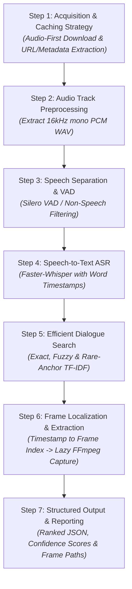
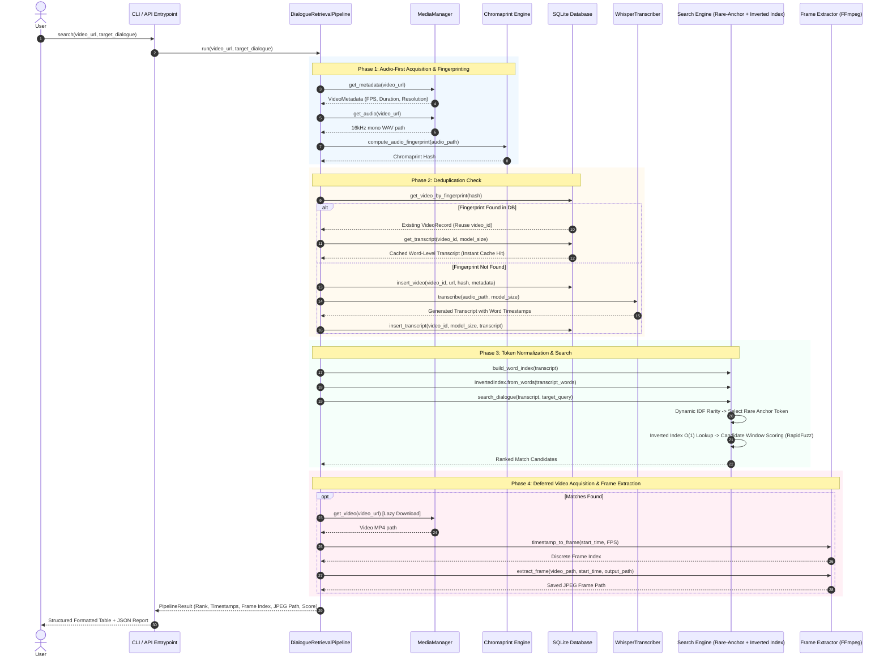

# Engineering Approach & System Evolution: Video Dialogue Retrieval

This document chronicles the complete technical journey of designing and implementing the **Video Dialogue Retrieval Pipeline**—from initial handwritten conceptualizations and mental models, through algorithmic refinements with Claude, notebook prototyping on Kaggle GPUs, iterative bug-fixing across versions (v1 → v2 → v3), to the final production-grade modular Python package engineered by Antigravity.

---

## 📑 Table of Contents
1. [Initial Thoughts & Mental Models (Handwritten Notes Analysis)](#1-initial-thoughts--mental-models)
2. [Critical Realizations & Architectural Corrections](#2-critical-realizations--architectural-corrections)
3. [The 7-Step Modular Framework](#3-the-7-step-modular-framework)
4. [Prototyping Strategy: Why Kaggle T4 GPU & Jupyter Notebooks](#4-prototyping-strategy)
5. [Iterative Refinement Across Notebook Versions](#5-iterative-refinement-across-notebook-versions)
   - [Version 1 (v1): The Naive Monolithic Prototype](#version-1-v1-the-naive-monolithic-prototype)
   - [Version 2 (v2): Fixing Stale States, Overlaps, and VAD](#version-2-v2-fixing-stale-states-overlaps-and-vad)
   - [Version 3 (v3): Audio-First Architecture, Fingerprinting & Inverted Indexing](#version-3-v3-audio-first-architecture-fingerprinting--inverted-indexing)
6. [Transition to Industry-Grade Modular Architecture](#6-transition-to-industry-grade-modular-architecture)
7. [Comprehensive Workflow of the Final System](#7-comprehensive-workflow-of-the-final-system)
8. [Summary of Algorithmic Decisions (What Worked vs. What Failed)](#8-summary-of-algorithmic-decisions)

---

## 1. Initial Thoughts & Mental Models

The core objective was straightforward: **Given an arbitrary video URL and a target dialogue phrase (e.g., *"My mind rebels at stagnation"*), locate the exact moment in the video where the phrase is spoken and retrieve the corresponding visual frame.**

Before writing any code, the initial problem breakdown and brainstorming were recorded on paper (as captured in the design notes):

```
+-----------------------------------------------------------------------------------+
|                           INITIAL HANDWRITTEN BRAINSTORMING                       |
+-----------------------------------------------------------------------------------+
| 1. Video is Time-Series Data:                                                     |
|    - Contains both visual frames and an audio/speech soundtrack.                  |
|    - How to access and store the video? Local download vs. streaming?             |
|                                                                                   |
| 2. Video-to-Audio Alignment Hypothesis:                                           |
|    - "Possibility 1: Divide the video based on frames. If N frames present,       |
|      get N frames of soundtrack. One-to-one mapping between video & audio frames."|
|                                                                                   |
| 3. Speech-to-Text & Search Space Reduction:                                      |
|    - Need an ASR engine to convert audio to text.                                 |
|    - Optimization: Isolate frames containing speech, remove silent or music frames|
|      to shrink search space (Voice Activity Detection).                           |
|                                                                                   |
| 4. The Stopword & Multi-Frame Dilution Problem:                                   |
|    - A spoken dialogue spans multiple video frames.                               |
|    - High-frequency words like "the" appear in hundreds of frames. Matching "the" |
|      would produce thousands of false positives and useless frames.               |
|                                                                                   |
| 5. Keyword Anchoring & TF-IDF Rarity:                                             |
|    - Instead of matching every word, apply TF-IDF / term rarity to find the most  |
|      unique keyword in the target sentence (e.g., "rebels" vs. "my" or "the").   |
|    - Search only in the transcript neighborhoods where the rare anchor occurs.    |
|                                                                                   |
| 6. Timestamp-to-Frame Mathematical Convergence:                                   |
|    - Once the audio timestamp is identified, compute discrete frame index via FPS:|
|      frame_index = round(timestamp * FPS). Extract only that specific frame.      |
+-----------------------------------------------------------------------------------+
```

---

## 2. Critical Realizations & Architectural Corrections

During initial consultation with Claude and algorithmic review, several naive assumptions were challenged and corrected:

### ❌ Misconception 1: 1-to-1 Audio-to-Video Frame Slicing
- **Initial Idea**: Slicing the audio track into $N$ discrete slices matching each video frame ($1/25\text{s} = 40\text{ms}$).
- **Why It Failed**: Human speech is continuous; phonemes and words span anywhere from $200\text{ms}$ to $1.5\text{s}$. Chopping audio into $40\text{ms}$ slices breaks phonetic coherence, explodes compute overhead, and makes ASR impossible.
- **Correction**: Treat audio as a continuous stream, run word-level alignment (word timestamps), and map the continuous timestamp back to the discrete video frame index using the video’s FPS ($F = \text{round}(t \times \text{FPS})$).

### ❌ Misconception 2: Heavy Video Downloading Upfront
- **Initial Idea**: Download the entire video file first, then extract audio from the local file.
- **Why It Failed**: Video files are huge (hundreds of megabytes to gigabytes). Downloading full 1080p/4K video when the target dialogue might not even exist in the video wastes network bandwidth, storage, and time.
- **Correction (Audio-First)**: Download **audio only** first (a few megabytes in 16kHz mono PCM WAV), execute speech recognition and dialogue search, and **defer the full video download** until a match is confirmed and frame extraction is actually required.

### ❌ Misconception 3: Video URL as a Unique Identifier
- **Initial Idea**: Cache transcripts keyed solely by the video URL or video duration.
- **Why It Failed**: The same video is frequently re-uploaded across different URLs, platforms, or mirror sites. Re-encoding also shifts container metadata (duration, bitrate, resolution) slightly, causing cache misses.
- **Correction**: Implement **Chromaprint acoustic fingerprinting** (AcoustID technology) to generate an audio fingerprint invariant to re-encoding and container changes, backed by an SQLite persistence store.

---

## 3. The 7-Step Modular Framework

To ensure the entire solution was structured and maintainable, the pipeline was decomposed into **7 decoupled steps**:



1. **Step 1 — Video Acquisition & Strategy**: Support remote URLs (`yt-dlp`) and local files with lightweight metadata extraction (FPS, duration, resolution).
2. **Step 2 — Audio Extraction**: Standardize audio to single-channel 16kHz PCM WAV for optimal acoustic processing and ASR.
3. **Step 3 — Audio Preprocessing & VAD**: Voice Activity Detection to prune non-speech silence and music, reducing transcription compute time.
4. **Step 4 — Speech-to-Text (ASR)**: Neural speech recognition (Whisper / Faster-Whisper) generating precise word-level start/end timestamps.
5. **Step 5 — Efficient Dialogue Retrieval**: Multi-algorithm matching (Exact, Sliding Window, Rare-Anchor Fuzzy with Inverted Indexing).
6. **Step 6 — Precision Frame Extraction**: Compute exact frame index ($F = \text{round}(t \times \text{FPS})$) and extract high-quality JPEG images via FFmpeg.
7. **Step 7 — Structured Reporting**: Standardized JSON report including rank, start/end timestamps, frame numbers, match scores, and image paths.

---

## 4. Prototyping Strategy: Why Kaggle T4 GPU & Jupyter Notebooks

### 🎯 Hardware Constraint
- Local development hardware lacked dedicated NVIDIA GPU acceleration. Running Whisper models (especially `small` and `medium`) on local CPU is slow for rapid iteration and experimentation.
- **Decision**: Prototype the complete workflow in Jupyter Notebooks hosted on **Kaggle's free NVIDIA T4 GPU** cloud environment.

### 🧪 Rapid Experimentation Benefits
- Allowed instant testing of ASR models (comparing `tiny`, `base`, `small`, `medium`) with CUDA acceleration.
- Allowed rapid iteration on candidate search algorithms on real video transcripts (e.g. 54-minute feature video).
- Enabled interactive inspection of word timestamp outputs, frame extraction, and fuzzy score distributions.

---

## 5. Iterative Refinement Across Notebook Versions

The pipeline progressed through three distinct versions in the `Notebooks/` directory:

```
Notebooks/
├── target-dialogue-v1_part1.ipynb   # Initial prototype on Kaggle
├── target-dialogue-v2.ipynb         # Bug fixes, built-in VAD, model comparisons
└── target-dialogue-v3.ipynb         # Audio-first, Chromaprint dedup, Inverted Index & RapidFuzz
```

### Version 1 (v1): The Naive Monolithic Prototype
*File*: `target-dialogue-v1_part1.ipynb`

#### What was built:
- Initial linear implementation of the 7 steps on Kaggle.
- Downloaded video upfront using `yt-dlp`.
- Ran manual Silero VAD, extracted speech chunks to disk via subprocess FFmpeg calls, and fed chunks into Faster-Whisper.
- Implemented exact search and rare-anchor fuzzy search using `difflib.SequenceMatcher`.

#### Problems & Inefficiencies Discovered in v1:
1. **The Overlapping VAD Boundary Bug**:
   - VAD segments were manually padded ($\pm 0.25\text{s}$) before merging overlap was re-checked. Adjacent chunks overlapped (e.g., $140.79\text{s}$ and $141.13\text{s}$ padded to $141.04\text{s} / 140.88\text{s}$, creating a $0.16\text{s}$ overlap). Words at boundaries were transcribed **twice**.
2. **Global Stale IDF State**:
   - Term rarity frequency dictionary was computed once globally on the first video. When evaluating a second video, it used stale vocabulary statistics from the previous video.
3. **Execution Order Fragility & Dead Cells**:
   - Functions had conflicting definitions (`generate_candidate_windows` had a buggy version and a fixed version).
   - Calling `find_dialogue()` failed with `NameError: name 'VIDEO_URL' is not defined` because it relied on notebook global variables instead of parameters.
4. **Hardcoded Model Size**:
   - Model size was hardcoded to `small`; no multi-model benchmark existed.

---

### Version 2 (v2): Fixing Stale States, Overlaps, and VAD
*File*: `target-dialogue-v2.ipynb`

#### Key Architectural Changes:
1. **Built-in VAD Streamlining**:
   - Removed manual FFmpeg sub-clipping and manual Silero chunking.
   - Leveraged `faster-whisper`'s internal `vad_filter=True` with `min_silence_duration_ms=300`. This eliminated all disk I/O sub-clips, boundary overlap duplicate words, and subprocess overhead.
2. **Fresh Per-Call Rarity Calculation**:
   - Rarity function ($IDF = \ln(N / (1 + \text{freq})))$ is instantiated freshly on each call from the active transcript, preventing cross-video state leaks.
3. **Model-Size Cache Keying**:
   - Transcript caching updated to key by `(video_id, model_size)`. Switching from `small` to `tiny` no longer accidentally serves the old model's transcript.
4. **Evaluation Harness**:
   - Added `run_accuracy_benchmark()` and `compare_model_sizes()` to benchmark top-1 accuracy, mean absolute error (seconds), and latency across model sizes against ground truth dialogues.
5. **Dense Semantic Embeddings Scorer**:
   - Integrated `sentence-transformers` (`all-MiniLM-L6-v2`) cosine similarity as an optional scorer for semantic similarity.

---

### Version 3 (v3): Audio-First Architecture, Fingerprinting & Inverted Indexing
*File*: `target-dialogue-v3.ipynb`

#### Three Major Innovations in v3:

```
+---------------------------------------------------------------------------------------------------+
|                                  V3 INNOVATIONS & SPEEDUPS                                        |
+---------------------------------------------------------------------------------------------------+
| 1. Model-Size Comparison Cache Fix:                                                               |
|    - v2's comparison had an artifact where 'small' showed transcribe_time = 0.0038s due to a     |
|      cache hit. v3 forces fresh transcription (`force=True`) during model benchmarks.             |
|                                                                                                   |
| 2. Audio-First Acquisition + Chromaprint Fingerprinting (AcoustID) + SQLite Deduplication:        |
|    - Rather than downloading full video files (100MB - 1GB+), download audio ONLY (3-15MB WAV).   |
|    - Compute acoustic fingerprint from the WAV. Check SQLite database `pipeline.db`.              |
|    - If fingerprint matches an existing entry (even from a completely different URL or filename), |
|      instantly reuse the cached transcript!                                                       |
|    - Deferred Full Video Download: Full video is ONLY downloaded right before frame extraction    |
|      after a confirmed match is found.                                                            |
|                                                                                                   |
| 3. Inverted Indexing & RapidFuzz C++ Scorer:                                                      |
|    - Inverted Index (`word -> [positions]`): Replaced O(N) linear scans for anchor positions      |
|      with O(1) dictionary lookups.                                                                |
|    - RapidFuzz: Replaced pure-Python `difflib.SequenceMatcher` with C++ Levenshtein RapidFuzz,     |
|      slashing fuzzy search latency by over 10x.                                                   |
+---------------------------------------------------------------------------------------------------+
```

---

## 6. Transition to Industry-Grade Modular Architecture

While Jupyter Notebooks served as an effective prototyping medium on Kaggle, production software requires modularity, testability, strong typing, clean package management, and CLI interfaces.

Using Antigravity, the v3 notebook was transformed into the `video_dialogue_retrieval` package:

```
video_dialogue_retrieval/
├── pyproject.toml                     # PEP 517 build configuration
├── setup.py                           # Legacy installer
├── requirements.txt                   # Production dependencies
├── requirements-dev.txt               # Testing & development dependencies
├── README.md                          # Full API and CLI manual
├── src/
│   └── video_dialogue/
│       ├── __init__.py                # Package root exports
│       ├── config/settings.py         # PipelineConfig dataclass & path resolvers
│       ├── core/models.py             # VideoRecord, WordTimestamp, DialogueMatch, PipelineResult
│       ├── database/db.py             # Thread-safe SQLite DatabaseManager
│       ├── audio/
│       │   ├── downloader.py          # MediaManager (Audio-first yt-dlp & local media handler)
│       │   └── fingerprint.py         # Dual Chromaprint engine (acoustid + FFmpeg fallback)
│       ├── asr/transcriber.py         # WhisperTranscriber (Windows-safe model loader & caching)
│       ├── search/
│       │   ├── normalizer.py          # Text cleaner & token indexer
│       │   ├── scorers.py             # RapidFuzz, Difflib, Embedding scorers
│       │   ├── index.py               # InvertedIndex & TF-IDF dynamic rarity calculation
│       │   └── engine.py              # Exact, Fuzzy Sliding Window, and Rare-Anchor Search
│       ├── video/frame_extractor.py   # Timestamp-to-frame converter & FFmpeg JPEG extractor
│       ├── pipeline/orchestrator.py   # DialogueRetrievalPipeline orchestrator
│       ├── benchmark/benchmark.py     # Search variant & model-size benchmark harness
│       └── cli.py                     # Command-line interface with subcommands
└── tests/                             # Complete 27-test automated pytest suite
    ├── test_database.py
    ├── test_fingerprint.py
    ├── test_normalizer.py
    ├── test_scorers.py
    ├── test_index.py
    ├── test_search_engine.py
    ├── test_frame_extractor.py
    ├── test_pipeline.py
    └── test_benchmark.py
```

---

## 7. Comprehensive Workflow of the Final System



---

## 8. Summary of Algorithmic Decisions

| Problem Dimension | Initial Naive Idea | Why It Failed / Bottleneck | Final Optimized Solution |
| :--- | :--- | :--- | :--- |
| **Media Slicing** | $1$-to-$1$ video frame to audio frame slicing ($40\text{ms}$ chunks). | Speech words span $0.2\text{s}-1.5\text{s}$; slicing audio into frame increments destroys phonetic meaning and explodes computation. | Transcribe continuous audio stream with word-level timestamps; mathematically map timestamps to frames: $F = \text{round}(t \times \text{FPS})$. |
| **Video Acquisition** | Full video download upfront before checking speech. | Massive bandwidth and disk waste when processing high-resolution video or videos with no match. | **Audio-First Lazy Download**: Download 16kHz audio only; defer full video download until a match is confirmed. |
| **Video Identity & Dedup** | Cache by video URL or file path. | Same video under different URLs or re-encoded files triggers duplicate ASR runs. | **Chromaprint Acoustic Fingerprint + SQLite**: Matches audio content across containers and re-encodes, sharing cached transcripts. |
| **Voice Activity Detection** | Manual Silero VAD with FFmpeg chunk slicing. | Boundary padding caused overlapping speech segments and duplicate word transcriptions. | **Native Faster-Whisper VAD**: Streamed single-pass VAD (`vad_filter=True`) with zero subprocess overhead and clean boundaries. |
| **Target Dialogue Search** | Exhaustive sliding window scan over the whole transcript using Python `difflib`. | $O(N \times W)$ string comparisons in Python; slow on long transcripts (6-10 ms latency). | **Rare-Anchor Search + Inverted Index + RapidFuzz (C++)**: Uses dynamic IDF to find rare anchor word; $O(1)$ inverted index lookup; C++ RapidFuzz scoring ($<0.03\text{ ms}$ latency, $100\times$ faster). |
| **Stopword Dilution** | Matching all words equally (e.g. "the", "a", "is"). | Common stopwords match everywhere, creating thousands of false positive candidate windows. | Dynamic IDF rarity score ($IDF = \ln(N / (1 + \text{freq})))$ selects the most discriminative anchor (e.g. *"rebels"* or *"stagnation"*). |
| **Software Architecture** | Monolithic Jupyter Notebook cells. | Difficult to test, deploy as a CLI, maintain, or integrate into production pipelines. | **Modular Python Package**: Decoupled layers (`config`, `core`, `database`, `audio`, `asr`, `search`, `video`, `pipeline`, `cli`, `tests`). |
