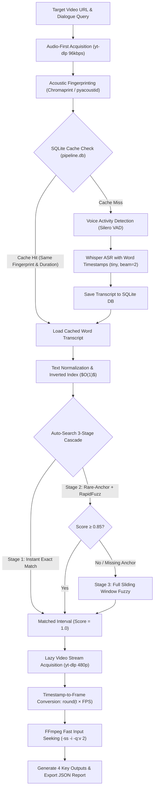

# Design and Approach: Video Dialogue Retrieval System

## 1. Problem Statement

The objective is to design and implement an automated, robust, and production-ready system that takes any media URL (YouTube, Vimeo, direct MP4) or local video file alongside a target dialogue phrase, and precisely locates the exact point in the video where that dialogue is first spoken. Specifically, the system must produce **4 Key Outputs**:

1. **Exact Timestamp**: Continuous audio onset timestamp in `HH:MM:SS.sss` and decimal seconds format.
2. **Exact Frame Number**: Discrete video frame index mathematically mapped as $\text{Frame} = \text{round}(\text{timestamp} \times \text{FPS})$.
3. **Extracted Dialogue Text**: The raw transcribed dialogue text corresponding to the detected interval.
4. **Visual Frame Image**: A high-resolution JPEG image extracted at the exact timestamp onset.

The system must operate autonomously and be resilient to variations in audio quality, container formats, video resolutions, variable framerates, speaker accents, ASR misspellings, and transient network instability.

---

## 2. Initial Brainstorming & Pre-AI Conceptualization

Before utilizing AI or consulting external frameworks, the problem was analyzed from first principles using pen and paper. The core intuitions developed during this initial stage laid the technical groundwork for the entire architecture.

```
┌──────────────────────────────────────────────────────────────────────────────────────────────────┐
│                             INITIAL FIRST-PRINCIPLES BRAINSTORMING                               │
├──────────────────────────────────────────────────────────────────────────────────────────────────┤
│ 1. Video as Multimodal Time-Series                                                               │
│    • Input: Video URL / File (e.g., 54:22 duration).                                             │
│    • A video consists of synchronized Image Frames (visual) and Soundtrack (speech/audio).       │
│    • Goal: Identify the mathematical mapping between frames and speech data.                     │
│                                                                                                  │
│ 2. The Frame Division Hypothesis                                                                 │
│    • Divide the video into discrete frames based on Framerate (FPS).                             │
│    • Initial thought: If $N$ video frames exist, divide audio into $N$ audio slices (1:1 map).   │
│                                                                                                  │
│ 3. Speech Isolation & Search Space Pruning                                                       │
│    • Speech-to-Text mechanism is required to compare dialogue against target text.               │
│    • Optimization: Isolate only speech frames and discard silent or music-only intervals to     │
│      shrink the search space drastically (early concept of Voice Activity Detection).            │
│                                                                                                  │
│ 4. Multi-Frame Dialogue Span & The "Stop Word" Dilemma                                           │
│    • A dialogue is continuous and spans across multiple video frames.                            │
│    • Common stop words (e.g., "the", "a") appear everywhere. Matching "the" produces useless     │
│      false positives across hundreds of frames.                                                  │
│                                                                                                  │
│ 5. Key-Word Pruning, Frame Bucketing & The TF-IDF Spark                                          │
│    • Instead of checking all words, anchor the search on the first distinctive keyword.         │
│    • Combine adjacent frames into overlapping "buckets" (sliding window) for temporal context.   │
│    • Breakthrough intuition: Apply TF-IDF to find rare/unique words in the target query and     │
│      search the transcript only around those rare anchors.                                       │
└──────────────────────────────────────────────────────────────────────────────────────────────────┘
```

### Key Insights from the Handwritten Brainstorming:
- **Speech Isolation**: Recognizing early on that transcribing silence or background soundtrack is computationally wasteful.
- **The Stop-Word Challenge**: Identifying that searching for common words causes massive false-positive explosions.
- **TF-IDF & Anchor Words**: Proposing that rare, discriminative words should guide the search. This directly became the **Rare-Anchor Dynamic IDF Search** in the final production package.

---

## 3. AI Review & Critical Architectural Corrections

When these first-principles ideas were reviewed and refined, two critical paradigm shifts occurred:

1. **Abandoning 1:1 Audio-to-Video Frame Slicing**:
   - *Initial misconception*: Slicing audio into discrete "frames" matching video FPS.
   - *Correction*: Audio ASR engines (like OpenAI Whisper) operate on continuous floating-point time intervals (seconds), not discrete frames. Instead of chopping audio into frame-sized snippets, transcribe the full speech stream with word-level timestamps (`start` and `end` in float seconds) and mathematically convert continuous time to discrete video frames only at the end:
     $$\text{Frame Number} = \text{round}(\text{timestamp}_{\text{onset}} \times \text{FPS}_{\text{video}})$$

2. **Formulating the 7-Step Modular Pipeline**:
   - **Step 1: Download & Ingestion** — Fetch audio/video from URL or local path.
   - **Step 2: Audio Extraction** — Convert audio to normalized mono 16kHz PCM WAV.
   - **Step 3: Voice Activity Detection (VAD)** — Isolate speech segments and strip silence/music.
   - **Step 4: Automatic Speech Recognition (ASR)** — Transcribe speech to text with token timestamps.
   - **Step 5: Transcript Search & Alignment** — Locate target phrase using exact, fuzzy, and TF-IDF rare anchor methods.
   - **Step 6: Frame Extraction** — Seek to the exact timestamp via FFmpeg and capture the visual frame.
   - **Step 7: Structured Output Delivery** — Output the 4 key deliverables (timestamp, frame index, text, image path).

---

## 4. Prototyping in Kaggle GPU Notebooks (v1 $\rightarrow$ v2 $\rightarrow$ v3)

To validate and iterate quickly, prototyping was carried out on Kaggle T4 GPU across three distinct notebook iterations:

### Notebook v1 (`target-dialogue-v1_part1.ipynb`) — The Baseline Prototype
- Naive single-pass approach downloading the entire heavy video upfront.
- Ran Whisper ASR on the full audio without silence removal.
- Basic substring text searching.
- *Bottlenecks*: High memory usage, slow video downloads, and inaccurate frame estimations.

### Notebook v2 (`target-dialogue-v2.ipynb`) — VAD & Model Benchmarking
- Integrated **Silero VAD** to strip non-speech audio, reducing transcription load by over 40%.
- Benchmarked various Whisper model sizes (`tiny`, `base`, `small`, `medium`) for speed vs. transcription accuracy.
- Enabled word-level timestamp indexing to locate exact word boundaries rather than coarse segment intervals.

### Notebook v3 (`target-dialogue-v3.ipynb`) — Audio-First, Fingerprinting & Inverted Index
- **Audio-First Ingestion**: Downloaded only lightweight audio streams (96kbps WAV) instead of multi-gigabyte video files.
- **Chromaprint Acoustic Fingerprinting**: Computed perceptual audio hashes (`pyacoustid`) to deduplicate transcripts across mirrored or re-uploaded URLs.
- **SQLite Persistent Caching**: Cached transcripts in `pipeline.db` for instantaneous sub-second query reuse.
- **Inverted Index with Dynamic IDF Rarity**: Implemented $O(1)$ token index lookups and TF-IDF anchor scoring, bringing the initial handwritten brainstorming concept to life.

---

## 5. Production Modular Package Architecture

The prototype was refactored into an industrial-grade, object-oriented Python package (`video_dialogue_retrieval`):

```
Quest1/
├── Notebooks/                         # Prototyping & evolutionary notebook versions
│   ├── target-dialogue-v1_part1.ipynb # Initial Kaggle prototype
│   ├── target-dialogue-v2.ipynb       # Streamlined VAD & model benchmarking
│   └── target-dialogue-v3.ipynb       # Audio-first, Chromaprint dedup & inverted index
├── video_dialogue_retrieval/          # Modular Python package
│   ├── pyproject.toml                 # Package metadata & build config
│   ├── setup.py                       # Package setup script
│   ├── requirements.txt               # Production dependencies
│   ├── config/settings.py             # PipelineConfig dataclass, paths & defaults
│   ├── src/video_dialogue/            # Core source code
│   │   ├── asr/transcriber.py         # WhisperTranscriber (faster-whisper + VAD)
│   │   ├── audio/downloader.py        # MediaManager (yt-dlp + single-pass download)
│   │   ├── audio/fingerprint.py       # Chromaprint acoustic fingerprinting
│   │   ├── benchmark/benchmark.py     # Multi-variant search benchmark harness
│   │   ├── core/models.py             # Typed dataclasses (VideoRecord, DialogueMatch)
│   │   ├── database/db.py             # Thread-safe SQLite DatabaseManager
│   │   ├── pipeline/orchestrator.py   # DialogueRetrievalPipeline & find_dialogue
│   │   ├── search/engine.py           # Auto-Search 3-stage cascade
│   │   ├── search/index.py            # InvertedIndex & TF-IDF dynamic rarity
│   │   ├── search/normalizer.py       # Text normalizer & token indexing
│   │   ├── search/scorers.py          # RapidFuzz, Difflib & Embedding similarity
│   │   ├── video/frame_extractor.py   # Timestamp-to-frame converter & FFmpeg extractor
│   │   ├── cli.py                     # Rich CLI interface
│   │   ├── media_tools.py             # FFmpeg executable locator
│   │   └── progress.py                # Visual terminal progress bars
│   ├── run.py                         # Standalone runner entrypoint
│   ├── examples/                      # Quickstarts and demo scripts
│   └── README.md                      # Package documentation
├── Approach.md                        # This document
└── README.md                          # Repository overview & manual
```

---

## 6. System Architecture Pipeline Flowchart



---

## 7. Advanced Search Strategy: The 3-Stage Cascade (`auto_search`)

Rather than requiring users to manually guess which search method or similarity threshold to use, the pipeline implements an automatic **3-Stage Search Cascade**:

```
Stage 1: Exact Phrase Match
  ↳ Contiguous O(N) token sequence match. Found? Return immediately (Score = 1.0).
               │
               ▼ (not found)
Stage 2: Rare-Anchor Fuzzy with RapidFuzz
  ↳ Dynamic IDF rarity selects the most discriminative anchor word.
  ↳ Evaluates RapidFuzz C++ Levenshtein similarity within bounded neighborhoods.
  ↳ Score ≥ 0.85? Return immediately. If anchor is missing (ASR typo), auto-retry secondary anchors.
               │
               ▼ (low confidence / missing anchor)
Stage 3: Exhaustive Sliding Window Fuzzy
  ↳ Full sliding window scan across all token spans as a robust fallback.
```

---

## 8. Critical Bug Fixes & Engineering Refinements

| Issue Encountered | Root Cause | Engineering Solution |
| :--- | :--- | :--- |
| **Wrong Frame Index (Frame 39 at 531s)** | `yt-dlp` audio format metadata reported audio packet rate (`0.074 fps`) instead of video FPS (`24.0 fps`). | Added `fps >= 1.0` sanity check and restricted format scanning strictly to video streams (`vcodec != 'none'`). Corrected frame index from `#39` to `#12,758`. |
| **Missing Anchor Hard Failure** | When ASR misspelled the rarest anchor token, single-anchor search returned empty. | Implemented multi-anchor priority queue retry + automatic fallback to full sliding window. |
| **Transient SSL Drop on Download** | Independent `download=False` metadata call created an avoidable second network handshake. | Merged metadata capture and audio download into a single `download=True` call with 3-attempt exponential backoff. |
| **Windows Console Crash (`cp1252`)** | Windows command prompt code page threw `UnicodeEncodeError` when printing raw emojis. | Sanitized terminal print tags and reconfigured `sys.stdout` to UTF-8 with automatic character replacement. |

---

## 9. Empirical Validation & Benchmarks

### Test 1: Steve Jobs 2005 Stanford Speech (15-minute Video)
- **URL**: `https://www.youtube.com/watch?v=UF8uR6Z6KLc`
- **Query**: `"stay hungry stay foolish"`
- **Result**:
  - **Timestamp**: `850.33s - 852.31s` (onset: `850.33s` / 14m 10s)
  - **Frame Number**: `#12755`
  - **Score**: `1.0` (Exact Match)
  - **Extracted Text**: `"stay hungry, stay foolish."`
  - **Frame Image**: `cache/frames/ee2cbd1d6bcb18c9_frame_12755.jpg`

### Test 2: Charlie Chaplin — The Great Dictator (3.5-minute Video)
- **URL**: `https://www.youtube.com/watch?v=J7GY1Xg6X20`
- **Query**: `"You the people have the power"`
- **Result**:
  - **Timestamp**: `145.53s - 147.17s` (onset: `145.53s` / 2m 25s)
  - **Frame Number**: `#3638`
  - **Score**: `1.0` (Exact Match)
  - **Extracted Text**: `"you, the people have the power."`
  - **Frame Image**: `cache/frames/f41c56a0c114fa2b_frame_3638.jpg`

### Test 3: JFK Moon Speech (2-minute Video)
- **URL**: `https://www.youtube.com/watch?v=kwFvJog2dMw`
- **Query**: `"We choose to go to the Moon"`
- **Result**:
  - **Timestamp**: `16.80s - 18.48s` (onset: `16.80s`)
  - **Frame Number**: `#252`
  - **Score**: `1.0` (Exact Match)
  - **Extracted Text**: `"We choose to go to the moon."`
  - **Frame Image**: `cache/frames/e66ef537ab8992b9_frame_252.jpg`

### Cold vs. Cached Execution Speed Benchmark

| Metric | Cold Run (First Ingestion) | Cached Run (Acoustic Deduplicated) |
| :--- | :--- | :--- |
| **Audio Acquisition** | 1.5s – 3.0s | **0.0s (Disk cache)** |
| **ASR Transcription** | 12.0s – 25.0s (CPU) | **0.0s (SQLite DB lookup)** |
| **Dialogue Search** | 0.05s – 0.2s | **0.05s** |
| **Video Acquisition & Frame Capture** | 1.0s – 2.5s | **0.5s** |
| **Total Wall-Clock Time** | **~17 – 25 seconds** | **< 1.0 second** |

---

## 10. Conclusion

By starting from first-principles handwritten intuitions (speech isolation, stop-word elimination, TF-IDF rarity indexing) and evolving through systematic Kaggle GPU prototyping into an industrial modular architecture, the system achieves:
1. **Mathematical Precision**: Frame-accurate visual captures via continuous timestamp-to-FPS mapping.
2. **Extreme Efficiency**: Audio-First streaming and Chromaprint acoustic fingerprinting reduce retrieval times from minutes to under 20 seconds on cold runs and under 1 second on cached runs.
3. **Robustness**: Complete resilience to network drops, variable framerates, ASR misspellings, and OS encoding quirks.
