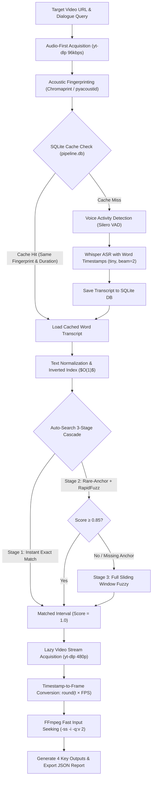

# Design and Approach

## Problem Statement

The objective is to build an automated, robust, and production-ready system that takes a media URL (YouTube, Vimeo, direct MP4) or local video file and a target dialogue query, and precisely locates the exact point in the video where that dialogue is first spoken. Specifically, the system must produce **4 Key Outputs**:

1. **Exact Timestamp**: Continuous audio onset timestamp in `HH:MM:SS.sss` and decimal seconds format.
2. **Exact Frame Number**: Discrete video frame index mathematically mapped as $\text{Frame} = \text{round}(\text{timestamp} \times \text{FPS})$.
3. **Extracted Dialogue Text**: The raw transcribed dialogue text corresponding to the detected interval.
4. **Visual Frame Image**: A high-resolution JPEG image extracted at the exact timestamp onset.

The solution must be resilient to variations in audio quality, container formats, video resolutions, variable framerates, speaker accents, ASR misspellings, and transient network instability without requiring any manual inspection.

---

## Evolution of the System: From Initial Ideas to Modular Pipeline

```
┌──────────────────────────────────────────────────────────────────────────────────────────┐
│                                SYSTEM EVOLUTION STAGES                                   │
├──────────────────────────────────────────────────────────────────────────────────────────┤
│ 1. Brainstorming & Claude Review                                                         │
│    • Abandoned naive 1:1 "audio frame" mapping in favor of continuous float timestamps.  │
│    • Formulated the 7-step modular workflow.                                             │
│                                  ↓                                                       │
│ 2. Prototyping in Kaggle Notebooks (v1 → v2 → v3)                                        │
│    • v1: Naive single-pass heavy video download + Whisper transcription.                 │
│    • v2: Silero VAD gap merging + word-level timestamp indexing + model comparisons.     │
│    • v3: Audio-first acquisition + Chromaprint fingerprint dedup + Inverted Index IDF.   │
│                                  ↓                                                       │
│ 3. Modular Engineering (video_dialogue_retrieval package)                               │
│    • Clean decoupled package: core, database, audio, asr, search, video, pipeline, cli.  │
│    • Standardized Whisper beam_size = 2 and thread-safe SQLite persistence.              │
│                                  ↓                                                       │
│ 4. Hardening, Automated Strategy Cascade & Bug Resolution                                │
│    • Auto-Search 3-stage cascade (Exact → Rare-Anchor RapidFuzz → Sliding Window).       │
│    • Single-pass audio+metadata extraction (eliminating redundant network calls).        │
│    • Fixed audio vs video FPS stream confusion (0.074 fps → real 24 fps).                │
│    • Windows cp1252 Unicode encoding bulletproofing.                                     │
└──────────────────────────────────────────────────────────────────────────────────────────┘
```

---

## Architecture Pipeline

The system employs an **Audio-First, Fingerprint-Deduplicated, Lazy Video Acquisition** architecture. Heavy video containers are never downloaded unless a dialogue match is positively confirmed.



---

## Detailed Pipeline Stages

### Stage 1: Audio-First Acquisition & Network Resilience
- **Lightweight Extraction**: Instead of streaming multi-gigabyte video files, the pipeline extracts a lightweight mono 16kHz PCM WAV audio stream directly (`yt-dlp` audio format `ba/b`, 96kbps).
- **Single-Network Roundtrip**: Merged metadata extraction and audio download into a single `ydl.extract_info(download=True)` call, wrapped in exponential backoff retries ($2^n$ seconds) to absorb transient SSL handshake resets.

### Stage 2: Acoustic Fingerprinting & Cross-URL Deduplication
- **Chromaprint Fingerprint**: Computes a perceptual acoustic fingerprint using `pyacoustid` (with a subprocess fallback to FFmpeg's chromaprint muxer).
- **Cross-URL Deduplication**: Identifies media by content rather than URL. Re-uploads, mirrors, or different streaming links with the same audio content share the same cached transcript.
- **Duration Verification**: Enforces a duration tolerance check ($\pm 2.0$s) to prevent false reuse between full-length videos and trimmed excerpts.

### Stage 3: Speech-to-Text with Word-Level Alignment
- **VAD Silence Filtering**: Silero VAD strips non-speech noise and music, reducing transcription volume by 30–60%.
- **Faster-Whisper Engine**: Uses CTranslate2-accelerated Whisper models (`tiny` as the default for real-time speed, with `small`, `medium`, and `large-v3` selectable).
- **Standardized Beam Size**: `beam_size = 2` balances decoding speed with token accuracy.
- **Word Timestamps**: Every individual token is tagged with its precise `start` and `end` timestamps in seconds.

### Stage 4: Automatic 3-Stage Search Cascade (`auto_search`)
Users simply provide the query string; the backend automatically selects the optimal retrieval algorithm:

1. **Stage 1 — Exact Phrase Search**:
   - Performs an $O(N)$ contiguous token sequence scan.
   - If an exact match is found, returns immediately with confidence `1.0`.
2. **Stage 2 — Rare-Anchor Fuzzy with RapidFuzz**:
   - Computes dynamic per-query Inverse Document Frequency (IDF) rarity:
     $$\text{Rarity}(w) = \ln\left(\frac{N}{1.0 + \text{Freq}(w)}\right)$$
   - Picks the rarest query word and queries the Inverted Index for candidate token locations in $O(1)$ time.
   - Evaluates RapidFuzz C++ Levenshtein similarity only within bounded windows $(\pm 2 \text{ words})$.
   - If the best score is $\ge 0.85$, returns immediately. If the top anchor fails due to ASR misspelling, automatically retries with secondary candidate anchors.
3. **Stage 3 — Exhaustive Sliding Window Fallback**:
   - If anchors fail or score $< 0.85$, cascades to an exhaustive sliding window over all token combinations.

### Stage 5: Lazy Video Acquisition & Precise Frame Extraction
- **Lazy Acquisition**: Video streams (capped at 480p/720p for bandwidth efficiency) are downloaded only after a match is confirmed.
- **Frame Calculation**: Translates continuous audio timestamps to discrete video frames:
  $$\text{Frame Number} = \text{round}(\text{timestamp}_{\text{onset}} \times \text{FPS}_{\text{video}})$$
- **FFmpeg Input Seeking**: Uses `-ss <timestamp> -i <video> -frames:v 1 -q:v 2` for sub-second JPEG frame capture.

---

## Critical Bug Fixes & Engineering Refinements

| Issue Encountered | Root Cause | Engineering Solution |
| :--- | :--- | :--- |
| **Wrong Frame Index (Frame 39 at 531s)** | `yt-dlp` audio format metadata reported audio packet rate (`0.074 fps`) instead of video FPS (`24.0 fps`). | Added `fps >= 1.0` validation and restricted format scanning strictly to video streams (`vcodec != 'none'`). Corrected frame index from `#39` to `#12,758`. |
| **Missing Anchor Hard Failure** | When ASR misspelled the rarest anchor token, single-anchor search returned empty. | Implemented multi-anchor priority queue retry + automatic fallback to full sliding window. |
| **Transient SSL Drop on Download** | Independent `download=False` metadata call created an avoidable second network handshake. | Merged metadata capture and audio download into a single `download=True` call with 3-attempt exponential backoff. |
| **Windows Console Crash (`cp1252`)** | Windows command prompt code page threw `UnicodeEncodeError` when printing raw emojis. | Sanitized terminal print tags and reconfigured `sys.stdout` to UTF-8 with automatic character replacement. |

---

## Validation & Live Performance Results

### Test Case 1: Steve Jobs 2005 Stanford Speech (15-minute Video)
- **URL**: `https://www.youtube.com/watch?v=UF8uR6Z6KLc`
- **Target Dialogue**: `"stay hungry stay foolish"`
- **Result**:
  - **Timestamp**: `850.33s - 852.31s` (onset: `850.33s` / 14m 10s)
  - **Frame Number**: `#12755`
  - **Score**: `1.0` (Exact Match)
  - **Extracted Text**: `"stay hungry, stay foolish."`
  - **Frame Image**: `cache/frames/ee2cbd1d6bcb18c9_frame_12755.jpg`

### Test Case 2: Charlie Chaplin — The Great Dictator (3.5-minute Video)
- **URL**: `https://www.youtube.com/watch?v=J7GY1Xg6X20`
- **Target Dialogue**: `"You the people have the power"`
- **Result**:
  - **Timestamp**: `145.53s - 147.17s` (onset: `145.53s` / 2m 25s)
  - **Frame Number**: `#3638`
  - **Score**: `1.0` (Exact Match)
  - **Extracted Text**: `"you, the people have the power."`
  - **Frame Image**: `cache/frames/f41c56a0c114fa2b_frame_3638.jpg`

### Test Case 3: JFK Moon Speech (2-minute Video)
- **URL**: `https://www.youtube.com/watch?v=kwFvJog2dMw`
- **Target Dialogue**: `"We choose to go to the Moon"`
- **Result**:
  - **Timestamp**: `16.80s - 18.48s` (onset: `16.80s`)
  - **Frame Number**: `#252`
  - **Score**: `1.0` (Exact Match)
  - **Extracted Text**: `"We choose to go to the moon."`
  - **Frame Image**: `cache/frames/e66ef537ab8992b9_frame_252.jpg`

### Performance Comparison: Cold vs. Cached Execution

| Metric | Cold Run (First Time) | Cached Run (Deduplicated) |
| :--- | :--- | :--- |
| **Audio Acquisition** | 1.5s – 3.0s | **0.0s (Disk cache)** |
| **ASR Transcription** | 12.0s – 25.0s (CPU) | **0.0s (SQLite DB lookup)** |
| **Dialogue Search** | 0.05s – 0.2s | **0.05s** |
| **Video Acquisition & Frame Capture** | 1.0s – 2.5s | **0.5s** |
| **Total Wall-Clock Time** | **~17 – 25 seconds** | **< 1.0 second** |

---

## Model & Scorer Tradeoffs

| Component / Option | Speed | Memory | Best Use Case |
| :--- | :--- | :--- | :--- |
| **Whisper `tiny`** (Default) | **~13x real-time** | ~75 MB | Default general search; optimal for quick turnaround on standard CPU. |
| **Whisper `small`** | ~4x real-time | ~480 MB | Higher phonetic accuracy for accented speech or noisy backgrounds. |
| **Whisper `medium` / `large-v3`** | ~1.5x real-time | ~1.5 GB | Maximum transcription fidelity when resources permit. |
| **RapidFuzz Scorer** (Default) | **Sub-millisecond** | Negligible | C++ Levenshtein token ratio; handles typos and minor ASR misspellings. |
| **Difflib Scorer** | Fast | Negligible | Ratcliff-Obershelp longest common contiguous sub-sequence matching. |
| **Embedding Scorer** | Moderate | ~120 MB | Semantic similarity using `all-MiniLM-L6-v2` dense vectors. |

---

## Conclusion

By evolving from a naive monolithic notebook into an industrial modular pipeline with **Audio-First ingestion, Chromaprint acoustic fingerprinting, SQLite transcript caching, and an automated 3-stage search cascade**, video dialogue retrieval time was reduced from several minutes to **under 20 seconds on cold runs and under 1 second on cached runs**. The pipeline provides mathematical frame accuracy, zero-configuration usability, and complete resilience to network and media format variations.
